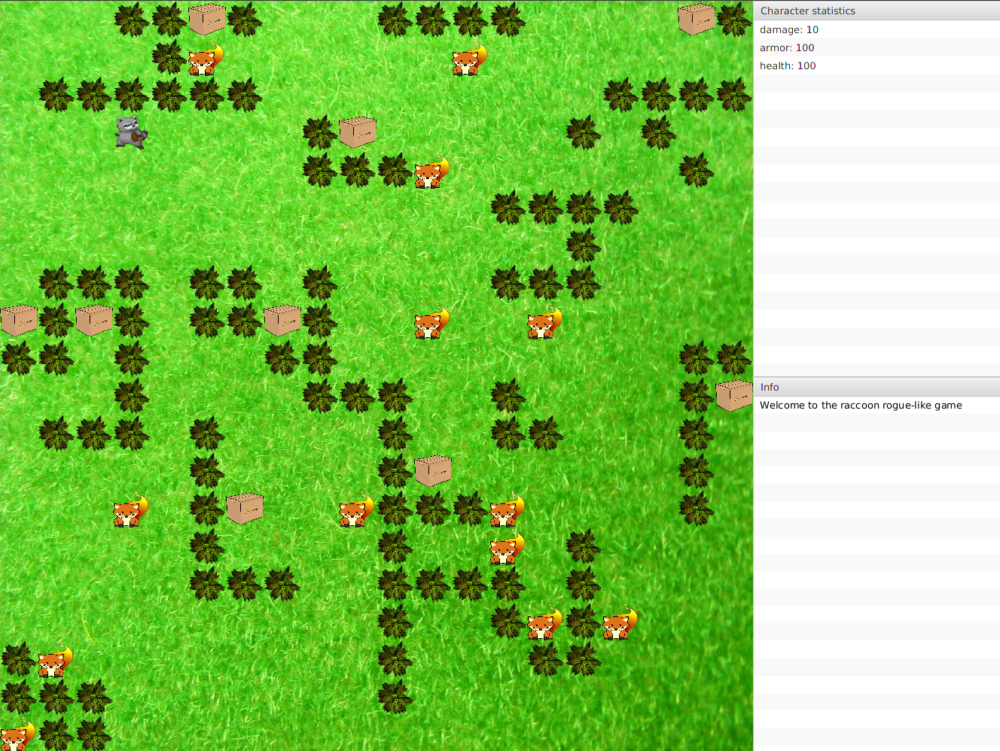
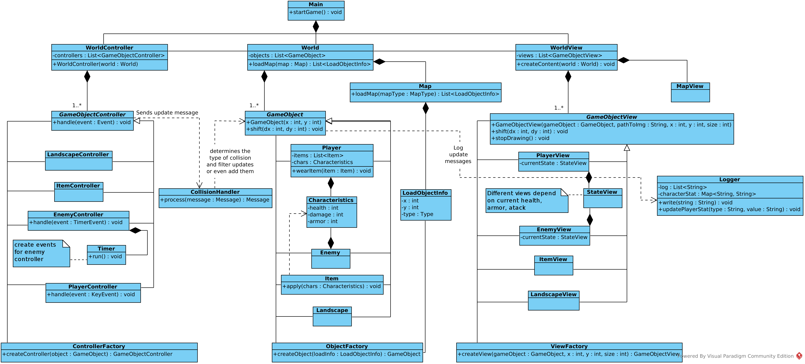
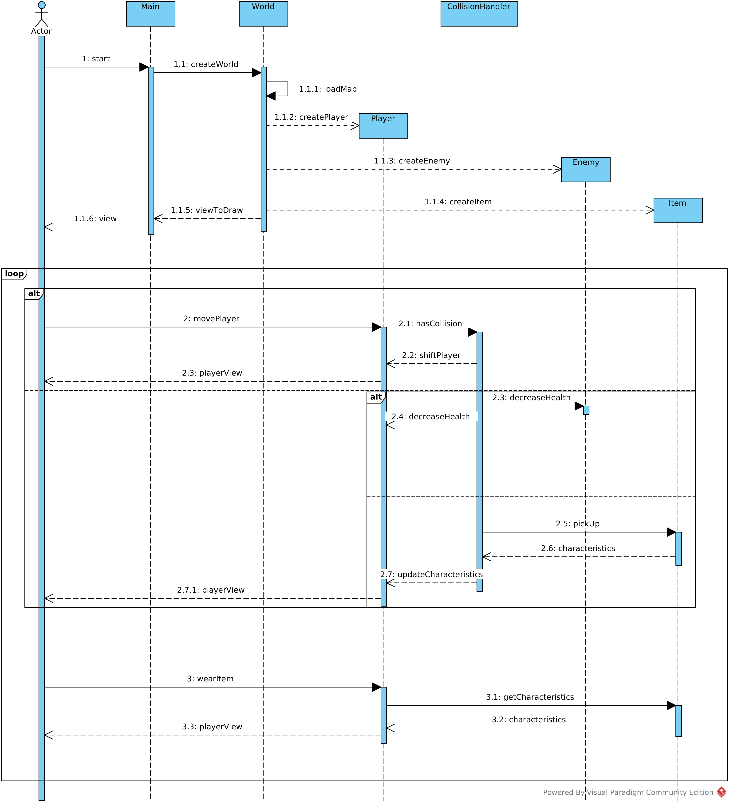
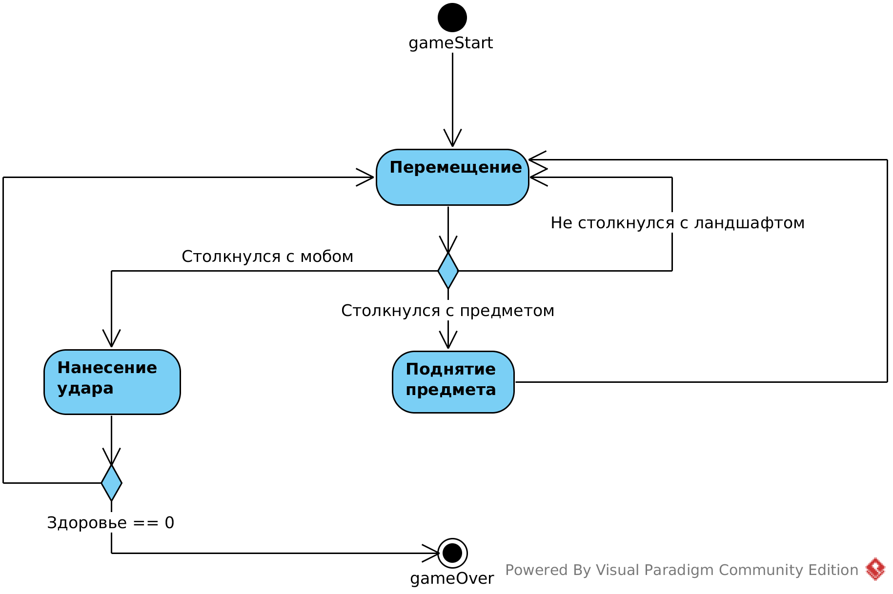

# Дизайн-документ

Игра представляет собой классическую RPG с видом сверху вниз и управлением одним персонажем.

## Общие сведения об игре

Все действия происходят на ограниченной карте прямоугольного размера,
считывающейся из файла. Игрок управляет одним персонажем, стрелочными
клавишами, может собирать различные предметы и сражаться с мобами.

**Условие выигрыша:** игрок убил всех мобов.

**Условие проигрыша:** игрок убит.

## Интерфейс

### Основные понятия:

## Карта

**Карта** -- это прямоугольная область, состоящая из тайлов.

**Тайл** -- квадратное изображение, размеры которого
подбираются динамически в зависимости от размера карты и общего количества тайлов.

На карте могут находится объекты 4 типов:
игрок, мобы, вещи, ландшафт.

**Моб** -- управляемый программно объект, моб атакует игрока в случае, если они пытаются занять одно и то же место на карте.

**Вещь** -- неподвижный объект на карте. При перемещении игрока в тайл
с вещью, вещь подбирается и в зависимости от её типа игрок получает те или иные бонусы.

Инвентарь у персонажа неограничен.

**Типы вещей**: меч тысячелетия, шлем, морковка и прочий мусор.
Меч увеличивают атаку игрока, шлем увеличивает защиту, морковка увеличивает здоровье. Мусор ничего не увеличивает.

**Ландшафт** -- неподвижный объект. Игрок не может занять ячейку, в которой находится объект типа ландшафт.

### Architectural drivers:

* Хотелось сделать расширяемую архитектуру, для того, чтобы потом можно было добавить в игровой процесс какую угодно логику.

* Различные живые существа соперники, наполнение ими игры, умеющие либо неумеющие перемещаться
по карте и имеющие свои собственные характеристики, тип перемещения и т.п.

* В задании упоминалась потребность в дальнейшем перейти на графический интерфейс, я решил это сделать сразу, несмотря на это смена юзер-интерфейса учитывалась при разработке архитектуры.

* Всевозможные предметы, которые мы можем подбирать и надевать на себя,
изменяя собственные характеристики.

* Гибкая боевая система на основе: объекты столкнулись -- нанесли друг
другу повреждения

### Роли и случаи использования

**Пользователь 1**

Имя: Косякова Мария

Возраст: 21 год

Образование: Высшее

Описание: любит простые и красивые игры, в которых нужно подумать,
либо, наоборот, полностью отключить мозг после сложного дня.
Занимается спортом, вернее спортивным программированием.

Особенности использования игры:
Поиграла, поскольку интересуется рогаликами.

**Пользователь 2**

Имя: Умхаев Руслан

Возраст: 13 лет

Образование: Без образования

Описание: Типичный школьник, лентяй, играет во все компьютерные игры, которые найдёт.

Особенности использования игры:
Открыл ради интереса, посоветовали друзья.

**Пользователь 3**

Имя: Сидорова Валентина Петровна

Возраст: 56 лет

Образование: Среднее

Описание: Бабушка. Интересуют игры с самым простейшим и очевидным управлением.

Особенности использования игры:
Заинтересовала разноцветная игра. Подошла, потыкала на все кнопки и забыла про
кастрюлю с супом на кухне.

## Наполнение

**Главные классы и интерфейсы:**
Entity, Message, World, GameObject.

Каждый класс, объекты которого тем или иным образом хотят общаться с другими
объектами, должны наследовать абстрактный класс Entity.

**Entity** -- содержит список подписчиков -- Entity. Может посылать сообщение
подписчикам, и обрабатывать сообщение (Message). Сообщение при обработке может
быть отфильтровано.

**GameObject** -- базовый класс, объект на карте. Ему также соответствуют классы
**GameObjectView** и **GameObjectController**.

**GameObjectView** -- класс, в котором содержится логика относительно того, как отображать
объект игры. **GameObjectController** -- класс, который обрабатывает события из "внешнего мира",
например, события приходящие от пользователя, и отправляющий соответствующие сообщения модели
-- GameObect'у.

# Используемые шаблоны

Основной используемый шаблон -- `publish-subscribe`.
Все объекты в игре могут посылать кому угодно сообщения об их изменении,
в свою очередь подписчики могут фильтровать сообщения и выбирать каким образом
на них реагировать.

`Factory` -- создание объектов, контроллеров и вьюверов.

# Диаграмма классов

# Диаграмма последовательности

Вначале запускается ui, он соответствует классу `Main`. После чего создается экземпляр
класса `World`, который, в свою очередь, загружает карту, начальные позиции всех объектов,
изображения, которые, накладываются на их "тайлы", после чего собирает всё это воедино и
отправляет на отрисовку.

Коллизии объектов между собой контроллирует `CollisionHandler`, например, прежде чем
произвести шаг игрока, он сначала проверяет, не стоит ли на этом месте кто-либо другой.
В случае, когда игрок пытается наступить на клетку с мобом он наносит урон ему, а моб
наносит урон игроку. Если же это был предмет, то игрок поднимает его и может либо
надеть, либо не надеть его, тем самым улучшив/ухудшив свои характеристики.

# Диаграмма активности

